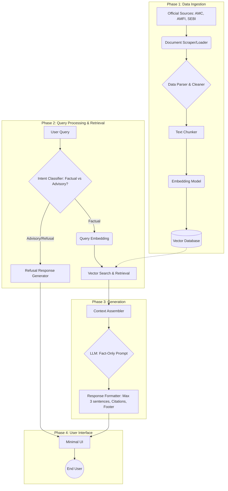
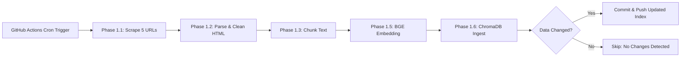

# Phase-Wise Architecture: Mutual Fund FAQ Assistant
# Phase-Wise Architecture: AI-Powered Review Discovery & MVP
This document outlines the detailed, phase-wise architecture for the Mutual Fund FAQ Assistant, a lightweight Retrieval-Augmented Generation (RAG) system designed to answer factual queries based on official AMC data.
This document outlines the end-to-end architecture for addressing the Spotify music discovery challenge, breaking it down into four distinct phases as outlined in the problem statement.
## High-Level Architecture Diagram

---
## Phase 0: Target Schemes & Knowledge Base
**Objective:** Define the specific mutual fund schemes that will constitute the knowledge base.
## Phase 1: AI-Powered Review Discovery Engine
For this project, the chosen Asset Management Company (AMC) is HDFC, and the following specific schemes from Groww will be indexed:
*   [HDFC Mid-Cap Opportunities Fund](https://groww.in/mutual-funds/hdfc-mid-cap-fund-direct-growth)
*   [HDFC Flexi Cap Fund](https://groww.in/mutual-funds/hdfc-equity-fund-direct-growth)
*   [HDFC Focused 30 Fund](https://groww.in/mutual-funds/hdfc-focused-fund-direct-growth)
*   [HDFC ELSS Tax Saver Fund](https://groww.in/mutual-funds/hdfc-elss-tax-saver-fund-direct-plan-growth)
*   [HDFC Top 100 Fund](https://groww.in/mutual-funds/hdfc-large-cap-fund-direct-growth)
**Goal:** Ingest user feedback at scale from diverse sources and extract actionable insights using LLMs.
---
### 1. Data Ingestion Layer
*   **Sources:**
    *   **Reddit:** Subreddits like `r/spotify`, `r/truespotify`, `r/Music` using the `praw` API.
    *   **App Stores:** Apple App Store and Google Play Store reviews using `google-play-scraper` and `app-store-scraper`.
    *   **Community Forums/Social Media:** Twitter/X mentions or Spotify Community forums.
*   **Ingestion Tooling:** 
    *   Python scripts scheduled via a lightweight orchestrator (e.g., cron, or an n8n workflow).
## Phase 1: Data Ingestion & Preprocessing
**Objective:** Collect, process, and index the curated corpus of official mutual fund documents to enable accurate retrieval.
### 2. Data Processing & Storage Layer
*   **Preprocessing:** Clean HTML, remove PII, and filter for reviews that mention keywords related to "recommendations," "discovery," "algorithm," "repetitive," "bored," etc.
*   **Storage:** 
    *   **Raw Data:** Stored in a SQLite/PostgreSQL database or simple JSON lines.
    *   **Vector DB:** Chunk the text and store embeddings in a lightweight Vector Database (e.g., ChromaDB or FAISS) to allow semantic queries like *"find complaints about the Discover Weekly algorithm."*
### Subphase 1a: Web Scraping & Sourcing
*   **Action:** Implement a scraping script to fetch HTML content from the 5 Groww URLs defined in Phase 0.
*   **Constraints:** Strictly limited to those 5 URLs. No external or linked pages will be followed.
*   **Output:** Save raw HTML files locally for debugging and as a backup.
### 3. AI Analysis Layer
*   **LLM Pipeline (e.g., using OpenAI GPT-4o or Claude 3.5 Sonnet):**
    *   Pass batches of reviews into the LLM with a structured prompt.
    *   **Task:** Perform Topic Modeling, Sentiment Analysis, and Intent Classification.
    *   **Outputs:** JSON structures answering the core questions:
        *   *Frustrations* (e.g., "Algorithm gets stuck in a loop").
        *   *Behaviors* (e.g., "Users create new playlists just to force new recommendations").
*   **Workflow Engine:** Optional use of **n8n** or **Zapier** to route new reviews directly to the LLM and append the structured JSON to a Google Sheet or database.
### Subphase 1b: HTML Parsing & Data Cleaning
*   **Action:** Parse the raw HTML using tools like `BeautifulSoup`. Extract the main text body containing the scheme details (expense ratio, exit load, etc.).
*   **Cleaning:** Strip out boilerplate navigation, footers, ad banners, and inline scripts.
*   **Output:** Clean text documents associated with their respective metadata (Source URL, Last Updated Date).
### 4. Dashboard (Insight Consumption)
*   **UI:** A lightweight **Streamlit** or **Gradio** app displaying:
    *   Aggregated themes of unmet needs.
    *   Semantic search bar over historical complaints.
### Subphase 1c: Text Chunking
*   **Action:** Break the cleaned flat text into smaller, overlapping segments suitable for the embedding window.
*   **Strategy:** Since the scraped HTML is flattened into plain text, use a fixed-size character chunker with paragraph awareness (e.g., chunk size of ~1000 characters / ~250 tokens, with ~100 characters of overlap) rather than a Markdown splitter.
*   **Output:** A list of text chunks for each scheme.
### Subphase 1d: Embedding & Vector Indexing
*   **Action:** Given the extremely small reality of the dataset (exactly 94 total chunks), generate vector embeddings locally using a lightweight open-source model like HuggingFace `all-MiniLM-L6-v2` via `sentence-transformers` to avoid external API costs or latency.
*   **Storage:** Instead of deploying a full-blown Vector Database (like ChromaDB or Pinecone), store the embeddings using a simple local FAISS index or a Numpy array, alongside a JSON file mapping chunk indices to their metadata.
*   **Output:** A serialized local vector index (e.g., `index.faiss` or `.npy`) and a metadata mapping file (`metadata.json`) ready for Phase 2.
### Subphase 1e (Phase 1.5): BGE Optimized Embedding
*   **Action:** Re-generate the vector embeddings using the `BAAI/bge-small-en-v1.5` model. This model is explicitly fine-tuned for asymmetric retrieval tasks and naturally handles our 200-250 token chunks perfectly.
*   **Storage:** Create a new local numpy array (`embeddings_bge.npy`) in the index directory.
*   **Output:** An optimized vector index built with `bge-small-en-v1.5` for higher retrieval accuracy in Phase 2.
### Subphase 1f (Phase 1.6): ChromaDB Integration
*   **Action:** To strictly follow standard RAG architectural patterns, migrate the storage of the 94 chunks and their pre-computed embeddings into a robust Vector Database.
*   **Storage:** Initialize a persistent local ChromaDB instance saving to `data/chroma_db/`. Create a collection named `mutual_fund_schemes` configured for cosine similarity and insert the chunks, metadata, and embeddings.
*   **Output:** A fully functional, persistent ChromaDB database ready for search operations in Phase 2.
---
## Phase 2: Query Processing & Retrieval
**Objective:** Understand the user query, ensure it is within the allowed scope, and retrieve the most relevant context using a **Metadata-Filtered Semantic Search** strategy.
## Phase 2: Validate the Opportunity Through User Research
### Subphase 2a: Intent Classification & Guardrails (Refusal Handling)
*   **Process:** Before retrieval, the query passes through a keyword-based intent classifier that detects advisory or subjective language.
*   **Detection Keywords:** Comparative adjectives ("best", "better", "worst"), subjective qualifiers ("should I", "recommend", "suggest", "worth it"), and performance comparison phrases.
*   **Classification:**
    *   *Advisory/Subjective:* E.g., "Which fund is better?", "Should I invest?"
    *   *Factual:* E.g., "What is the exit load?"
*   **Action:** If Advisory, immediately route to the **Refusal Handler** which returns a polite response reinforcing the facts-only limitation, along with a relevant educational link (e.g., AMFI or SEBI), bypassing the RAG pipeline entirely.
**Goal:** Take LLM-generated hypotheses and validate them with primary human research.
### Subphase 2b: Scheme Entity Extraction
*   **Process:** Extract the mutual fund scheme name from the user's query using fuzzy string matching against the 5 known scheme names/aliases.
*   **Mapping:** Map detected scheme references (e.g., "mid cap", "ELSS", "focused fund") to the corresponding `scheme_id` in our config.
*   **Fallback:** If no scheme is detected, proceed without filtering (search all 94 chunks).
### 1. Research Preparation
*   **AI-Assisted Guide Creation:** Use the insights from Phase 1 to automatically generate an interview script using an LLM.
*   **Screener:** Target users who have high engagement but low discovery diversity.
### Subphase 2c: Query Embedding
*   **Process:** Convert the factual query into a vector embedding using the same `BAAI/bge-small-en-v1.5` model from Phase 1.5.
*   **BGE Query Prefix:** Prepend `"Represent this sentence for searching relevant passages: "` to the raw query text before encoding. This is required by the BGE model for optimal asymmetric retrieval performance.
### 2. Interview & Transcription
*   **Transcription:** Record interviews and pass the audio through **OpenAI Whisper** for high-accuracy text transcription.
### Subphase 2d: Metadata-Filtered Vector Search
*   **Strategy:** If a scheme was identified in Subphase 2b, use ChromaDB's `where` filter to narrow the search to only that scheme's ~18-20 chunks. Otherwise, search all 94 chunks.
*   **Retrieval:** Query ChromaDB for the Top-K (K=3) most similar document chunks using cosine similarity.
*   **Output:** Return the top chunks along with their metadata (source URL, scheme ID, last updated date) for use in Phase 3 generation.
### 3. Synthesis
*   **LLM Summarization:** Feed the 5-6 transcripts into an LLM context window to extract patterns, validate/invalidate Phase 1 assumptions, and identify the exact user segment to focus on (e.g., "The Active Curation Seeker").
---
## Phase 3: Generation & Formatting
**Objective:** Generate a precise, constraint-bound response using the retrieved context.
## Phase 3: Define the Problem
### 1. Prompt Engineering (The RAG Prompt)
*   **System Prompt Constraints:**
    *   "You are a strict, facts-only mutual fund assistant."
    *   "Answer using ONLY the provided context."
    *   "If the context does not contain the answer, state exactly: 'I do not know the answer based on the provided context'."
    *   "Do not provide financial advice, opinions, or performance comparisons."
    *   "Never ask for, process, or include any Personal Identifiable Information (PII)."
    *   "Limit your response to a maximum of 3 sentences."
**Goal:** Frame a clear, business-driven problem statement.
### 2. LLM Inference
*   **Model Selection:** Groq API (e.g., Llama-3-70b or Mixtral-8x7b). Groq provides ultra-low latency inference which is perfect for real-time FAQ generation, and these open-weight models are highly capable of strict instruction adherence.
*   **Execution:** The LLM generates the factual response based on the Top-K context chunks.
### Deliverable: The PRD (Product Requirements Document)
*   **Root Cause Analysis:** Based on Phase 1 & 2. (Example Hypothesis: *Traditional collaborative filtering over-indexes on historical watch-time, locking users into 'safe' echo chambers. Users lack a deterministic way to steer the algorithm out of its local minima.*)
*   **Target Segment:** e.g., Power users who listen 20+ hours a week but feel high fatigue with their current library.
*   **Business Case:** Improving discovery diversity directly correlates with long-term retention (LTV) and reduces churn to competitors like Apple Music or YouTube Music.
### 3. Post-Processing & Citation
*   **Formatting:** The system extracts the metadata from the specific chunk(s) used by the LLM to generate the answer.
*   **Appends:**
    *   Source Link: Exactly one citation link appended to the text. **Crucially, if the LLM states it does not know the answer, do NOT attach any URL.**
    *   Footer: Appends the mandatory string: `Last updated from sources: <date>`.
---
## Phase 4: User Interface & Integration
**Objective:** Deliver the functionality through a minimal, secure, and compliant user interface.
## Phase 4: Build an AI-Native MVP
### 1. Minimal Frontend
*   **Stack:** Lightweight framework (e.g., React, Streamlit, or basic HTML/JS).
*   **Components:**
    *   **Welcome Message:** Clear statement of purpose.
    *   **Example Queries:** 3 clickable examples (e.g., "What is the expense ratio for Scheme X?").
    *   **Chat Interface:** Input box for queries and display area for responses and citations.
    *   **Disclaimer (Persistent):** A visible banner stating: *"Facts-only. No investment advice."*
**Goal:** Build a functional prototype demonstrating how AI solves this problem uniquely.
### 2. Backend API
*   **Stack:** Python (FastAPI or Flask).
*   **Functionality:** Exposes endpoints for the UI to submit queries and receive JSON responses containing the answer text, source link, and footer.
*   **Security:** Rate limiting, input sanitization, and strict logging (ensuring no PII is logged, as per privacy constraints).
### Concept: "Spotify Vibe Steer" / AI Discovery Co-Pilot
Instead of passive scrolling, users converse with an AI agent to explicitly steer their discovery session in real-time.
---
### MVP Architecture Stack
## Subphase 1g (Phase 1.7): Data Refresh & Scheduling (GitHub Actions)
**Objective:** Ensure the knowledge base always reflects the latest official data from the 5 target URLs without manual intervention.
#### 1. Frontend (User Interface)
*   **Tech:** React (Next.js) or Streamlit for rapid prototyping.
*   **UX:** A chat-like interface or smart search bar integrated into a mocked Spotify UI.
*   **Input:** Natural language (e.g., *"I want something like Arctic Monkeys but darker, instrumental, and high energy."*)
### Strategy
Use a **GitHub Actions scheduled workflow** (cron job) to automatically re-run the entire Phase 1 ingestion pipeline on a regular cadence.
#### 2. Backend & Integration (API Layer)
*   **Tech:** FastAPI (Python).
*   **Spotify Web API Integration:** Connect to the real Spotify API to fetch tracks, audio features (valence, energy, acousticness), and seed genres.
### Workflow Overview

#### 3. AI Agent Layer (The Core)
*   **LLM Router:** Takes the user's natural language prompt.
*   **Function Calling / Tool Use:** 
    *   The LLM translates the user's vague prompt into concrete Spotify API parameters.
    *   *Example:* User says "darker and high energy" -> LLM calls `get_recommendations(seed_genres=["indie"], target_valence=0.2, target_energy=0.8)`.
*   **Explainability:** The LLM receives the Spotify API results and generates a human-readable explanation for *why* these tracks match the prompt.
### Implementation Details
*   **Schedule:** Run daily or weekly via a cron expression (e.g., `0 2 * * 1` for every Monday at 2 AM UTC).
*   **Steps:**
    1.  Checkout the repository
    2.  Set up Python environment and install dependencies
    3.  Run Phase 1.1 → 1.2 → 1.3 → 1.5 → 1.6 sequentially
    4.  Compare the newly generated `metadata_bge.json` with the existing committed version
    5.  If changes are detected, commit and push the updated `data/index/` and `data/chroma_db/` directories
*   **Health Check:** Before committing, run the Phase 0 health check to ensure all 5 URLs are still accessible. If any URL fails, the workflow should alert via GitHub Issues or email instead of pushing corrupt data.
*   **Secrets:** No API keys or secrets required since we use open-source local models (`bge-small-en-v1.5`) and no external LLM calls during ingestion.
#### 4. The "Why AI?" Factor
*   **Why traditional systems fail here:** Collaborative filtering requires historical data and clicks. It cannot understand zero-shot, abstract concepts like "darker."
*   **What AI unlocks:** The ability to map semantic human intent directly to complex metadata vectors (audio features).
*   **User Experience:** Shifts discovery from **Passive/Algorithmic** to **Active/Conversational**, restoring user agency.
---
## Technology Stack Recommendations
|
 Component 
|
 Recommended Technology 
|
|
:---
|
:---
|
|
**
Backend Framework
**
|
 FastAPI (Python) 
|
|
**
Embedding Model
**
|
`BAAI/bge-small-en-v1.5`
 via 
`sentence-transformers`
|
|
**
Vector Database
**
|
 ChromaDB (persistent, local) 
|
|
**
LLM
**
|
 Groq API (Llama-3 or Mixtral for ultra-low latency) 
|
|
**
Frontend
**
|
 Streamlit (for rapid prototyping) or React/Vite 
|
|
**
Data Refresh
**
|
 GitHub Actions (scheduled cron workflow) 
|
